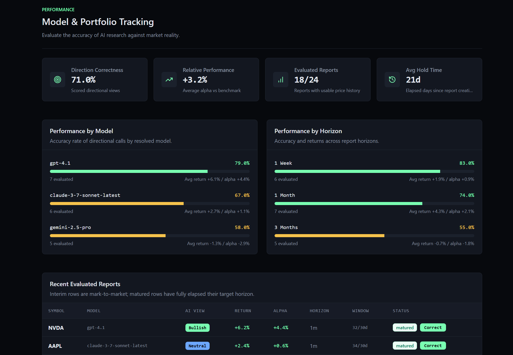
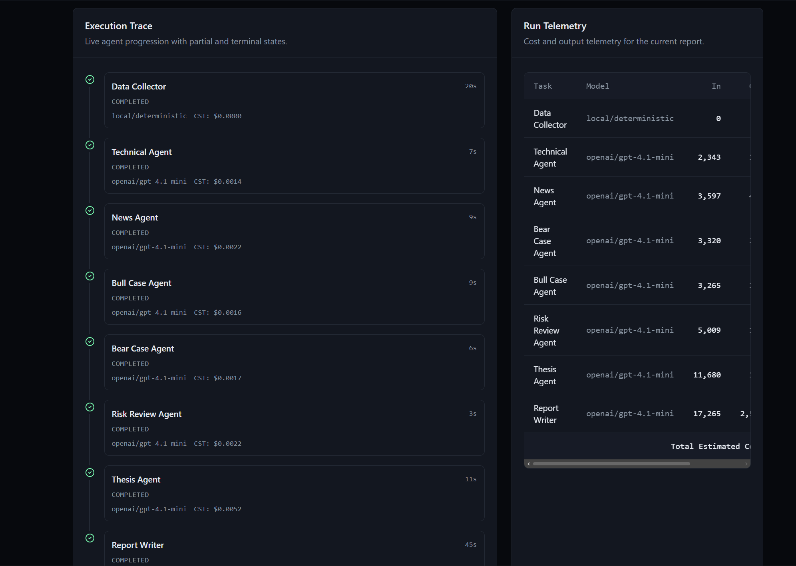
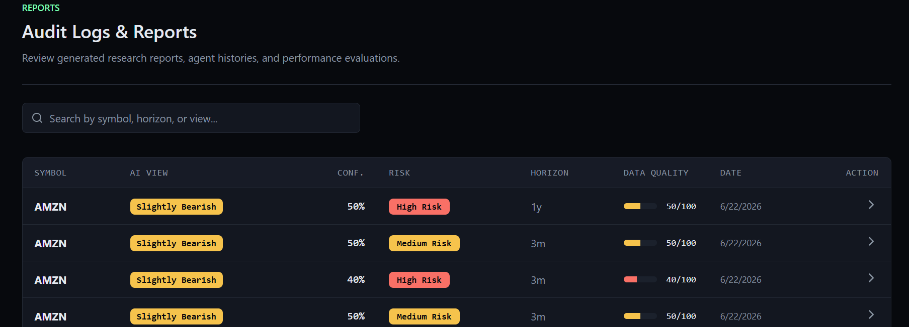

# OpenAlpha

<p align="center">
  <strong>Local-first AI equity research workstation for public stocks.</strong>
</p>

<p align="center">
  OpenAlpha runs on your machine, orchestrates a multi-agent research pipeline, stores every report in SQLite, and measures how past calls performed against the market.
</p>

<p align="center">
  
  
  
  
  
  
  
</p>

<p align="center">
  
</p>



## Overview

OpenAlpha is built for running equity research locally with a transparent agent pipeline:

- No hosted OpenAlpha account is required.
- Research runs are auditable step by step.
- Reports are persisted locally for later review.
- Historical calls can be scored against subsequent market performance.

## Why It Exists

| Focus | What OpenAlpha Does |
| --- | --- |
| Local-first | FastAPI, React/Vite, and SQLite run on your machine. |
| Auditable | You can inspect agent progression, outputs, sources, data-quality warnings, and estimated LLM cost traces. |
| Practical | One CLI command boots the backend and frontend together and prepares the local database. |
| Measurable | Saved reports are evaluated later so you can see whether the AI's directional view was actually right. |

## Tech Stack

| Layer | Frameworks / Tools |
| --- | --- |
| Backend | Python, FastAPI, SQLModel, Uvicorn |
| Frontend | React 18, Vite 6, TypeScript 5, Tailwind CSS 3 |
| Storage | SQLite |
| AI Providers | OpenAI, Claude, Gemini, Ollama |
| Dev Tooling | Pytest, Ruff, ESLint |

## Quick Start

### Prerequisites

- Python `3.10+`
- Node.js with `npm`

### Install and Run

From the repository root:

```powershell
py -3.10 -m venv .venv
.\.venv\Scripts\Activate.ps1
pip install -r requirements-dev.txt
pip install -e .
cd frontend
npm.cmd install
cd ..
openalpha run .
```

### Local URLs

- Frontend: `http://127.0.0.1:5173`
- Backend API: `http://127.0.0.1:8000`
- Health: `http://127.0.0.1:8000/api/health`

If a preferred port is already taken, `openalpha run .` automatically searches for the next available local port.

## What You Can Do

- Launch a research run from the dashboard or analysis page with a symbol, market, horizon, depth, provider, model, and optional research focus.
- Watch the live execution graph as the current pipeline runs:
  `data_collector -> technical/news -> bull/bear -> risk -> thesis -> report_writer`
- Review the final persisted report with summary, thesis, bull and bear cases, risk scoring, data quality, sources, and cost telemetry.
- Browse historical reports in the local report store.
- Evaluate past reports on the performance page, including direction correctness and relative performance versus `SPY` for US equities.

## Product Views

| Performance Tracking | Live Analysis Run |
| --- | --- |
|  |  |

| Reports History |
| --- |
|  |

## Supported Providers

### LLM Providers

| Provider | Status | Notes |
| --- | --- | --- |
| OpenAI | Supported | Full runtime support, settings persistence, and credential testing |
| Claude | Supported | Full runtime support, settings persistence, and credential testing |
| Gemini | Supported | Full runtime support, settings persistence, and credential testing |
| Ollama | Supported | Configure the Ollama base URL, test connectivity, fetch installed models, and run local analysis with zero API cost |

### Data Sources

OpenAlpha already ships with built-in provider surfaces for market data and news aggregation:

- Market data: `stooq`, `yahoo`, `yfinance`, `sec_edgar`, `user_api`
- News: `gdelt`, `rss`, `yahoo_finance_rss`, `sec_edgar_news`

See [providers.md](docs/providers.md) for current implementation details and limitations.

## Limitations

- OpenAlpha is an MVP research workstation, not a brokerage, execution engine, or portfolio manager.
- It is not a real-time institutional market terminal.
- Ollama requires a separate local install and at least one pulled model such as `ollama pull llama3.1`.
- The repo also contains aspirational design notes in [agent.md](agent.md); the shipped source of truth is the code and the docs linked below.

## Documentation

- [Installation Guide](docs/installation-guide.md)
- [Architecture](docs/architecture.md)
- [Agents](docs/agents.md)
- [Providers](docs/providers.md)
- [Adding a New Agent](docs/adding-a-new-agent.md)
- [Adding a New Provider](docs/adding-a-new-provider.md)

## Contributing

- [Contributing Guide](CONTRIBUTING.md)
- [Roadmap](ROADMAP.md)

## Disclaimer

OpenAlpha is an equity research tool for research and educational purposes only. It is not personalized financial advice, investment advice, or a recommendation to buy or sell any security.
